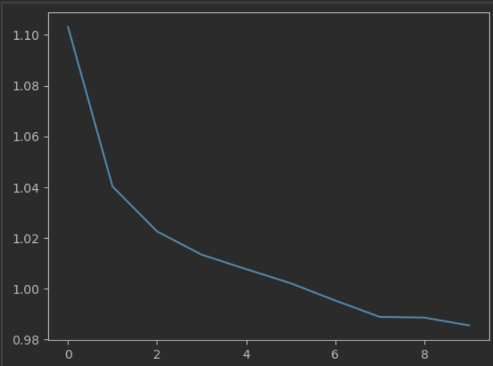
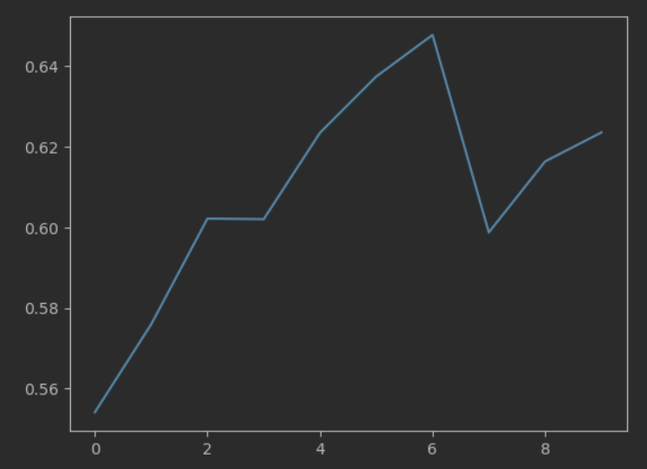

# Лабораторная работа 2  

## Предобработка  

### Создание Feature-Frame embeddings  

1) Берется 1 кадр из каждой секунды видео;  

2) [CutMix](utils.py). В каждый полученный кадр вставляется часть изображения из случайного кадра другого видео. Классы кодируются  
через one-hot-encoding и в качестве значения ставится часть, которая содержится на изображении от данного класса. Пример:  
на изображении класса 1 содержится 1/4 из видео с классом 3. Всего классов 4. Тогда вектор выглядит так: [0.75, 0, 0.25, 0].  

3) Полученное изображение передается в алгоритм [SWIN_B](models.py) и полученный вектор является feature-frame embedding.  

### Обучение

1) Модель. Архитектура модели содержится в файле [models.py](models.py). Модель обучена на векторном пространстве из предыдущего пункта.  
2) Потери при обучении:  
  
3) Accuracy при обучении. Лучшая точность: 65%:  
  

### Заключение  
Точность для каждого видео: 80%

Весь ход работы находится в [файле](ffe.ipynb)
