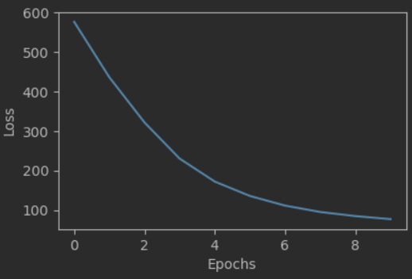
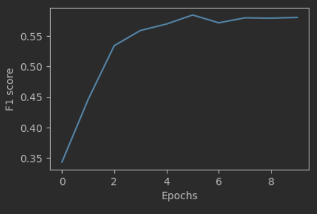

# Лабораторная работа 3  

## Архитектура 

Архитектура для задачи NER выбрана [BiLSTM + CRF](model.py)  
  
### Обучение

1) Текст разибивается на токены и подается в модель, где она преобразуется в embedding.  
2) Модель учится предсказывать сущность каждому токену. Обучение проходило 10 эпох.   
3) Потери при обучении:  
  
4) F1-score micro при обучении. Лучшая точность: 59%:  
  

### Заключение  

Весь ход работы находится в [файле](flow.ipynb)
